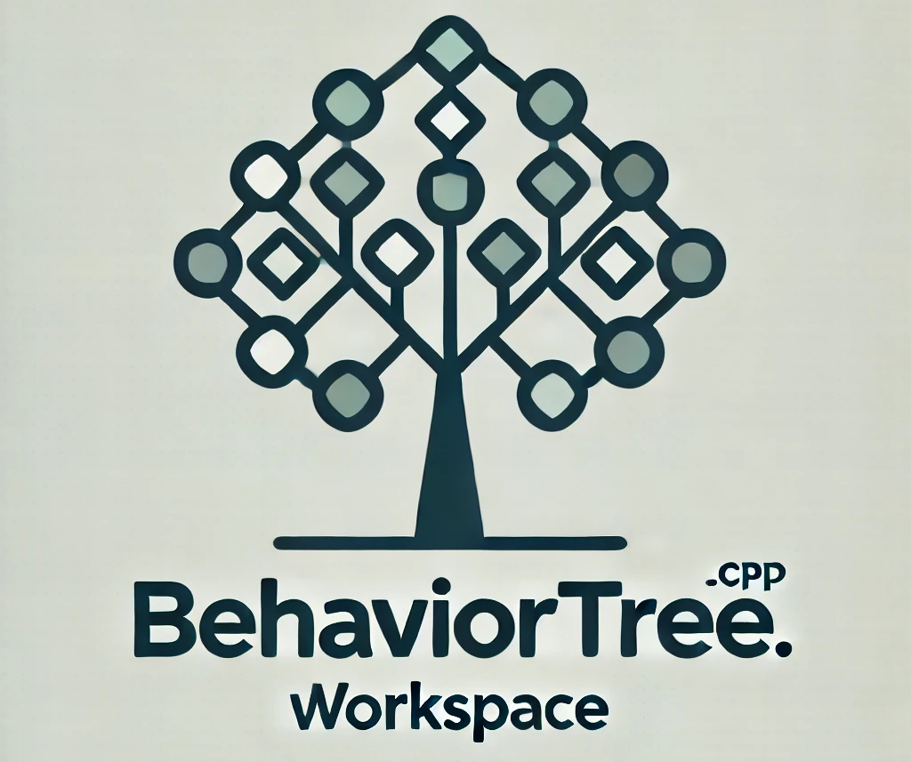
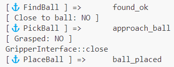

# BehaviorTree.CPP workspace

<p align="center">
  
</p>

## Overview

This workspace is designed for the development and testing of behavior trees using [BehaviorTree.CPP (BTCPP)](https://www.behaviortree.dev/), a powerful and flexible C++ library for building behavior trees. Behavior trees are an AI architecture widely used in robotics and games to manage complex decision-making processes. They are structured as hierarchical trees where each node represents a task, decision, or action, allowing for modular, reusable, and maintainable code.

## BehaviorTree.CPP

BehaviorTree.CPP is an open-source library that facilitates the creation and execution of behavior trees in C++. It provides a highly customizable and easy-to-use framework with various features such as asynchronous actions, reactive behaviors, and integration with other middleware and libraries. For more details on BehaviorTree.CPP, you can visit the [official website](https://www.behaviortree.dev/) or check out the [GitHub repository](https://github.com/BehaviorTree/BehaviorTree.CPP).

## Docker-based Development Environment

This workspace includes a Docker-based environment tailored for developing with BehaviorTree.CPP. The [Docker](https://www.docker.com/) environment ensures consistency across different development setups and simplifies dependency management. By using Docker, you can avoid the complexity of setting up your local environment, and quickly start developing, testing, and running behavior trees.


## Getting Started

To get started with the Docker environment, follow these steps:

1. Clone this repository:
    ```
    git clone https://github.com/mdirzpr/btcpp_ws.git
    ```

2. Build the Docker image using this command:

    ```
    cd btcpp_ws
    docker compose build
    ```

3. Start a container:

    ```
    docker compose run btcpp_ws
    ```

* For more detailed instructions on how to work with Docker, refer to the [official Docker documentation](https://docs.docker.com/).

## Test

In order to test BehaviorTree.CPP library, run this commands:

```
bash test.sh
```
and the output will be like this:




### Join the Community

For discussions, updates, and networking with other BehaviorTree.CPP users, consider joining the [BehaviorTree LinkedIn Group](https://www.linkedin.com/groups/13022577/).

### Developer and maintainer
- [Mahdi Rezapour](https://github.com/mdirzpr)
- Email: mahdi.rezapour@smartfactory.de
