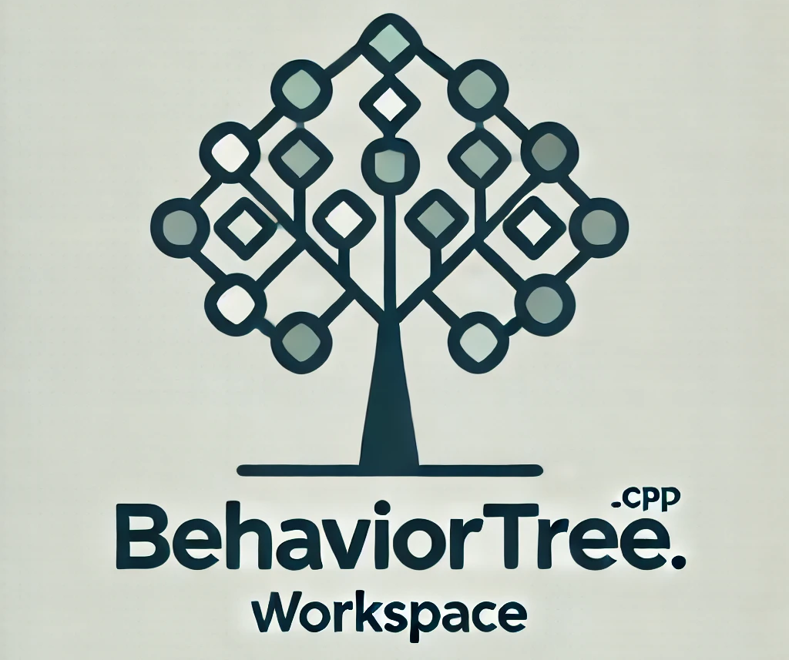

# BehaviorTree.CPP workspace

<p align="center">
  
</p>

## Overview

This workspace is designed for the development and testing of behavior trees using [BehaviorTree.CPP (BTCPP)](https://www.behaviortree.dev/), a powerful and flexible C++ library for building behavior trees. Behavior trees are an AI architecture widely used in robotics and games to manage complex decision-making processes. They are structured as hierarchical trees where each node represents a task, decision, or action, allowing for modular, reusable, and maintainable code.

## BehaviorTree.CPP

BehaviorTree.CPP is an open-source library that facilitates the creation and execution of behavior trees in C++. It provides a highly customizable and easy-to-use framework with various features such as asynchronous actions, reactive behaviors, and integration with other middleware and libraries. For more details on BehaviorTree.CPP, you can visit the [official website](https://www.behaviortree.dev/) or check out the [GitHub repository](https://github.com/BehaviorTree/BehaviorTree.CPP).

## Docker-based Development Environment

This workspace includes a Docker-based environment tailored for developing with BehaviorTree.CPP. The [Docker](https://www.docker.com/) environment ensures consistency across different development setups and simplifies dependency management. By using Docker, you can avoid the complexity of setting up your local environment, and quickly start developing, testing, and running behavior trees.


## Getting Started

### 1. Clone the repository

```bash
git clone https://github.com/mdirzpr/btcpp_ws.git
cd btcpp_ws
```

### 2. (Optional) Enable Groot2 visualization

If you want to use Groot2 for live tree visualization, run this on your **host** before starting the container:

```bash
xhost +local:docker
```

### 3. Build the Docker image

```bash
docker compose build
```

### 4. Start a dev container

```bash
docker compose run dev bash
```

## Build & Run `bt_example`

All commands below run **inside the container**.

### Build

```bash
cmake -S /dev_ws/src/bt_example -B /dev_ws/build/bt_example
cmake --build /dev_ws/build/bt_example
```

### Run the simulation demo

```bash
/dev_ws/build/bt_example/autonomy_node_sim \
    /dev_ws/src/bt_example/bt_structures/simulation_demo.xml
```

This runs the industrial manufacturing workflow tree (3D printing → pick-and-place → transport → QA → storage).

### Visualize with Groot2

While the simulation is running, launch Groot2 in a second terminal inside the container:

```bash
~/Groot2.AppImage &
```

Groot2 connects automatically on ZMQ port **1668**.

## Test

To run the quick smoke-test script:

```bash
bash test.sh
```


### Join the Community

For discussions, updates, and networking with other BehaviorTree.CPP users, consider joining the [BehaviorTree LinkedIn Group](https://www.linkedin.com/groups/13022577/).

### Developer and maintainer
- [Mahdi Rezapour](https://github.com/mdirzpr)
- Email: mahdi.rezapour@smartfactory.de
